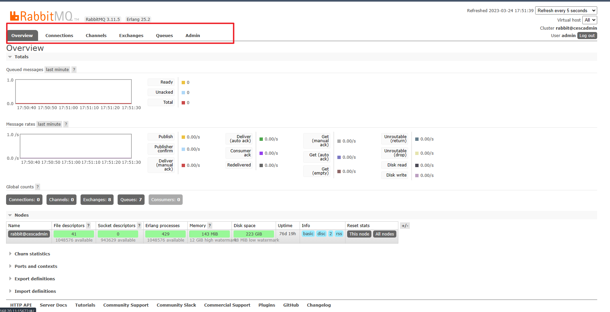
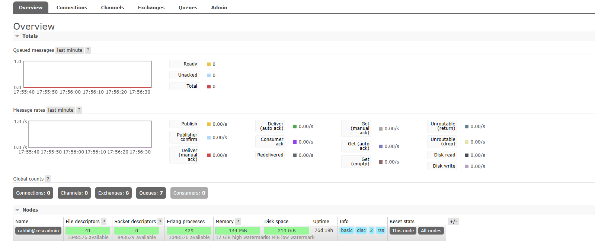
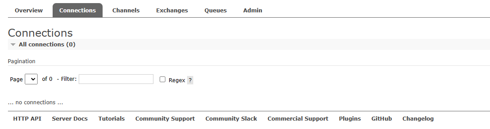
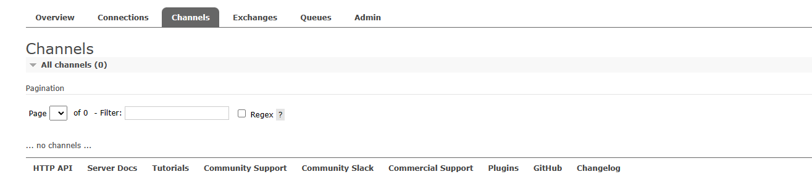
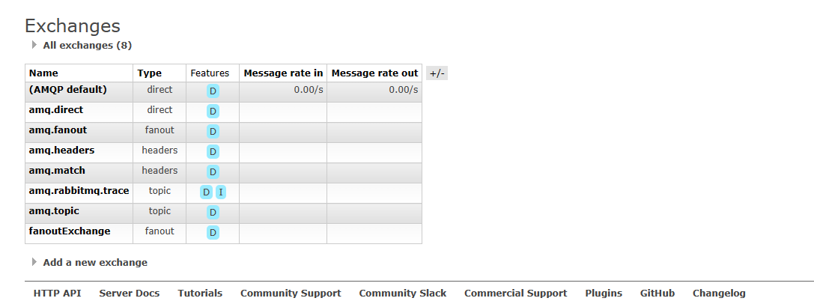

# 主界面介绍

共分为六大选项卡

[Overview](##Overview) ：MQ的概览情况，里面包括集群各个节点的信息、端口映射信息；
[Connections](##Connections)：每一个java后台对RabbitMQ连接的情况
[Channels](##Channels)：一个Connections里面包含多个Channel
[Exchanges](##Exchanges)：交换机，规则分发
[Queues](##Queues)：队列
[Admin](##Admin)

## Overview

**Totals**： 准备消费的消息数、待确认的消息数、消息总数以及消息的各种处理速率（发送速率、确认速率、写入硬盘速率等等）。
**Nodes**： 其实就是支撑 RabbitMQ 运行的一些机器，相当于集群的节点。点击每个节点，可以查看节点的详细信息。
**Churn statistics**： 展示的是 Connection、Channel 以及 Queue 的创建/关闭速率。

**Ports and contexts**：这个里边展示了端口的映射信息以及 Web 的上下文信息。
5672 是 RabbitMQ 通信端口。
15672 是 Web 管理页面端口。
25672 是集群通信端口。
**Export definitions && Import definitions**： 两个可以导入导出当前实例的一些配置信息

## Connections

MQ运行中的当前保持连接的连接信息，其中包含了连接的虚拟主机路径（virtual host），链接的主机及端口、哪个用户连接的，状态等信息。在java代码中通过ConnectionFactory 的 newConnection() 后进行创建一个连接，无论是消息生产者还是消息消费者，只要连接上来了这里都会显示出来，当使用connection.close()之后 连接将关闭。

## Channels

信道或者通道，Channel是在连接中存在的，一个Connection中可以有多个Channel。在Java代码中 通过连接来创建信道。当代码执行connection.createChannel()，该界面下面就会有信道信息，它和连接紧密相关；一个连接可以有多个通道，这个多个通道通过多线程实现，一般情况下，我们在通道中创建队列、交换机等。生产者的通道一般会立马关闭；消费者是一直监听的，通道几乎是会一直存在。

Channel：通道名称。
User name：该通道登录使用的用户名。
Model：通道确认模式，C 表示 confirm；T 表示事务。
State：通道当前的状态，running 表示运行中；idle 表示空闲。
Unconfirmed：待确认的消息总数。
Prefetch：Prefetch 表示每个消费者最大的能承受的未确认消息数目，简单来说就是用来指定一个消费者一次可以从 RabbitMQ 中获取多少条消息并缓存在消费者中，一旦消费者的缓冲区满了，RabbitMQ 将会停止投递新的消息到该消费者中直到它发出有消息被 ack 了。总的来说，消费者负责不断处理消息，不断 ack，然后只要 unAcked 数少于 prefetch * consumer 数目，RabbitMQ 就不断将消息投递过去。
Unacker：待 ack 的消息总数。
publish：消息生产者发送消息的速率。
confirm：消息生产者确认消息的速率。
unroutable (drop)：表示未被接收，且已经删除了的消息。
deliver/get：消息消费者获取消息的速率。
ack：消息消费者 ack 消息的速率。

## Exchanges

交换机，它与队列进行绑定后，消息根据exchang的类型，按照不同的绑定规则分发消息到消息队列中，可以是一个消息被分发给多个消息队列，也可以是一个消息分发到一个消息队列，和队列紧密相关；

Type 表示交换机的类型。
Features 有两个取值 D 和 I。D 表示交换机持久化，将交换机的属性在服务器内部保存，当 MQ 的服务器发生意外或关闭之后，重启 RabbitMQ 时不需要重新手动或执行代码去建立交换机，交换机会自动建立，相当于一直存在。I 表示这个交换机不可以被消息生产者用来推送消息，仅用来进行交换机和交换机之间的绑定。
Message rate in 表示消息进入的速率。Message rate out 表示消息出去的速率。

name 添加的交换机名称
type 交换机类型，有四种；
直连交换机：Direct exchange；
扇形交换机：Fanout exchange；
主题交换机：Topic exchange；
首部交换机：Headers exchange
Durability 是否需要持久化，设置是否持久 durab 设置为 true 表示持久化， 反之是非持久,设置为true则将Exchange存盘，即使服务器重启数据也不会丢失
Auto delete设置是否自动删除，当最后一个绑定到Exchange上的队列删除后，自动删除该Exchange，简单来说也就是如果该Exchange没有和任何队列Queue绑定则删除
Internal 设置是否为rabbitmq内部使用, true表示是内部使用, false表示不是内部使用
Arguments 分发器的其他设置项，json格式；可以设置消息最大数量等属性

下面还有一些常用的操作：
Bindings：交换机和队列建立绑定关系
Publish message：发送消息；通过交换机发送消息到和它有绑定关系的队列中；

## Queues

## Admin
